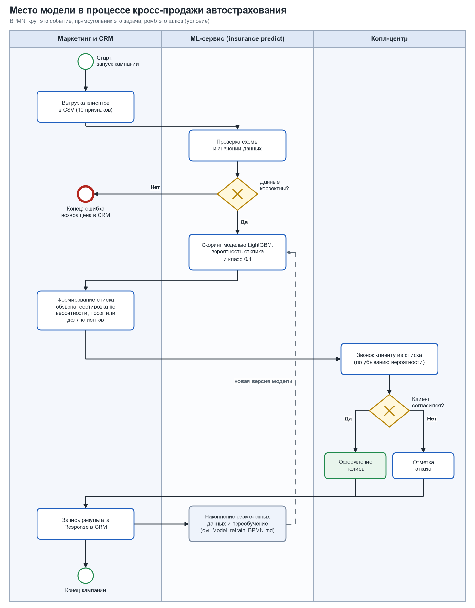
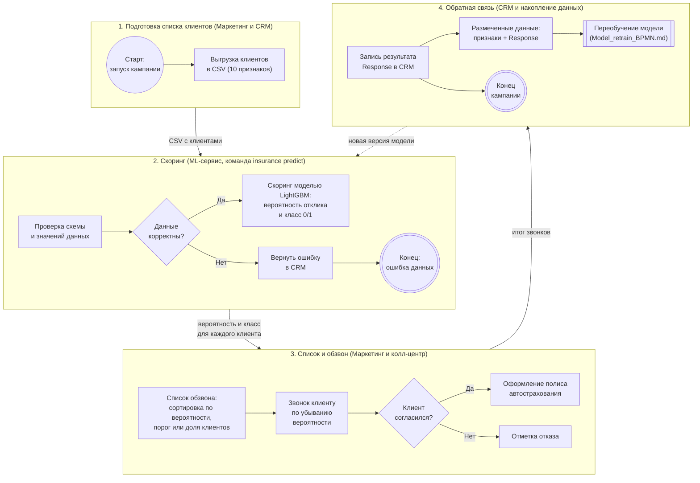
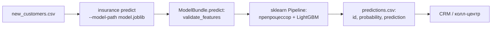

# Место модели в бизнес-процессе

Модель описана в [model_card.md](model_card.md). Здесь показано, где она работает в процессе
**«Кросс-продажа автострахования клиентам медицинского страхования»**: кто и на каком шаге использует её оценку и
что происходит с результатом.

Схема выполнена по нотации BPMN: круг это событие начала или конца, прямоугольник это задача, ромб это шлюз
(условие), вертикальные «дорожки» это участники процесса. Основной вариант приложен как изображение
(`docs/img/process_model.png`), та же схема в виде кода Mermaid лежит под ней и рендерится прямо в GitHub.

## 1. Схема процесса

Та же схема в виде кода Mermaid (рендерится в GitHub)

## 2. Какую задачу в процессе решает модель

Модель отвечает на вопрос: **«Кому из клиентов стоит предлагать автострахование в первую очередь?»**
Она получает признаки клиента и возвращает вероятность отклика. По этой оценке клиенты сортируются, и колл-центр
звонит не всем подряд, а сначала тем, кто с наибольшей вероятностью согласится.

## 3. Почему для этой задачи целесообразно использовать ML

- **Без модели приходится звонить всем.** Средняя конверсия около 12%: в среднем нужно около восьми звонков
  на одну продажу.
- **Простое правило работает хуже.** Правило «были повреждения автомобиля и нет страховки ранее» отмечает 48%
  клиентов и даёт ROC-AUC 0.788. Модель учитывает десять признаков и их взаимодействие, ROC-AUC 0.873.
- **Модель позволяет сократить обзвон.** Если звонить лучшим 30% клиентов по оценке модели, в списке окажется
  **81% всех будущих покупателей** при конверсии 33% против 12%. Лучшие 20% дают 62% покупателей при конверсии 38%.
- **Зависимости нелинейные и взаимосвязанные.** Например, отклик зависит от возраста, возраста автомобиля,
  наличия повреждений и канала продаж одновременно. Деревья решений такие зависимости находят автоматически,
  а ручные правила пришлось бы поддерживать вручную.
- **Данных достаточно.** Есть размеченные результаты прошлых кампаний (миллионы строк), модель можно
  регулярно переобучать (см. [Model_retrain_BPMN.md](Model_retrain_BPMN.md)).

Цифры получены на тестовой выборке проекта (подробности в разделе 7 карточки модели). Данные синтетические,
поэтому на реальной базе значения будут другими.

## 4. Какие данные поступают на вход модели

Таблица клиентов, строка на клиента, 10 признаков:

| Группа | Признаки |
|---|---|
| Клиент | `Gender`, `Age`, `Driving_License`, `Vintage` (дней с компанией) |
| История | `Previously_Insured` (есть ли страховка на авто), `Vehicle_Damage` (были ли повреждения) |
| Автомобиль и полис | `Vehicle_Age`, `Annual_Premium`, `Region_Code`, `Policy_Sales_Channel` |

Перед скорингом схема и значения проверяются (нет колонки, пропуски, неизвестные категории, отрицательные числа
отклоняются с понятной ошибкой). Полная таблица допустимых значений в [model_card.md](model_card.md#3-входные-и-выходные-данные).

## 5. Как результат работы модели используется дальше

| Результат модели | Как используется |
|---|---|
| `probability`, число от 0 до 1 | Клиенты сортируются по убыванию: получается приоритизированный список обзвона |
| `prediction`, 0 или 1 (порог 0.5 по умолчанию) | Быстрое разделение на «звонить» и «не звонить»; порог или долю обзвона выбирает маркетинг по стоимости звонка и прибыли с продажи |
| Итог звонка (согласился или отказал) | Записывается в CRM как `Response` |
| Накопленные размеченные данные | Попадают в обучающий набор и запускают плановое переобучение; новая версия сначала проходит проверки, а потом заменяет действующую |

Важно: оценка модели **не принимает решение за человека**. Она помогает выбрать, кому позвонить; решение о
продаже принимает клиент, а условия предложения определяет компания.

## 6. Техническая схема запуска (как это работает в проекте)

Команда: `insurance predict --model-path artifacts/lightgbm/model.joblib --input new_customers.csv --output predictions.csv`.
Тот же код можно запустить в Docker-контейнере (см. [README.md](README.md)).
