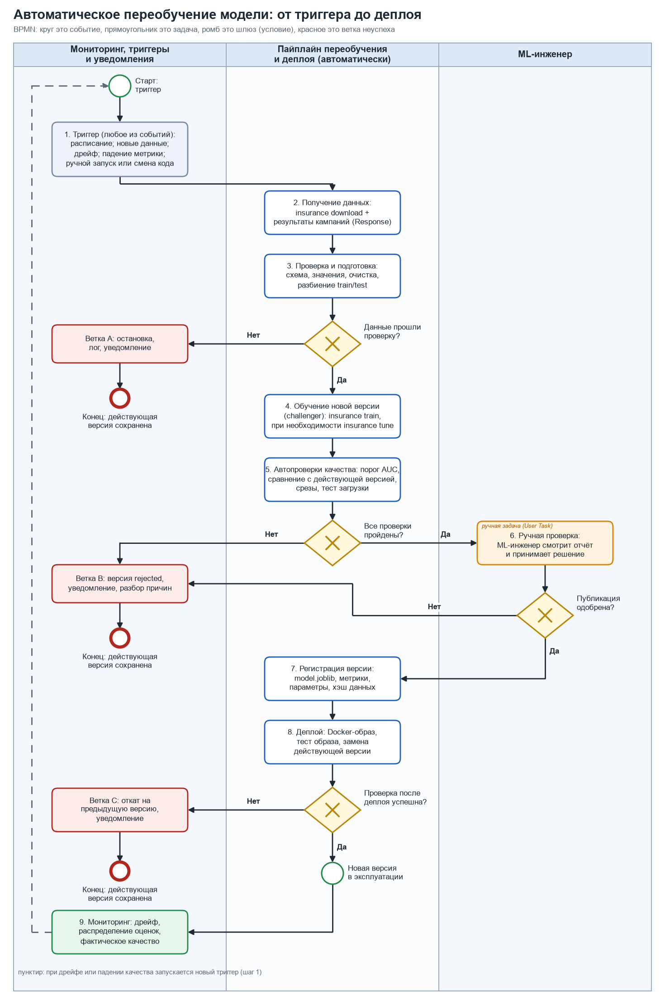
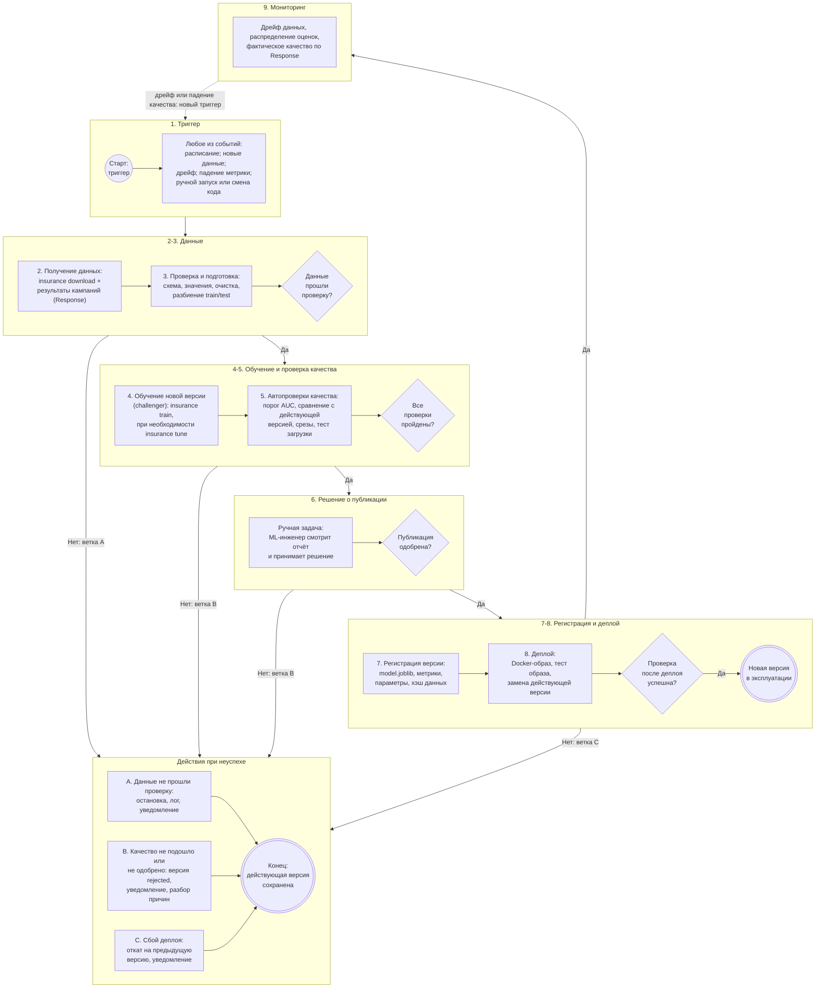

# Процесс автоматического переобучения модели

Процесс описывает, как в проекте новая версия модели появляется в эксплуатации: от события, запустившего
переобучение, до выкладки (деплоя), и что происходит, если проверки не пройдены. Модель описана в
[model_card.md](model_card.md), её место в бизнес-процессе в [Model_BPMN.md](Model_BPMN.md).

Принципы взяты из практики MLOps (непрерывное обучение, валидация данных и модели, сравнение с действующей
версией, реестр версий, откат). Основной ориентир: документ Google Cloud
[«MLOps: Continuous delivery and automation pipelines in machine learning»](https://cloud.google.com/architecture/mlops-continuous-delivery-and-automation-pipelines-in-machine-learning).

> **Статус.** Схема и правила описывают целевой процесс. В проекте уже реализованы загрузка и проверка данных,
> очистка, обучение, метрики, упаковка модели, Docker и CI. Планировщик, мониторинг дрейфа, реестр версий,
> автоматический деплой и уведомления пока не реализованы; таблица в разделе 4 показывает, что есть, а чего нет.

## 1. Схема процесса (BPMN)

Обозначения: круг это событие, прямоугольник это задача, ромб это шлюз (проверка условия), оранжевым
выделена ручная задача, красным ветки неуспеха, пунктир это обратная связь. Схема приложена как изображение
(`docs/img/retrain.png`), та же схема в виде кода Mermaid лежит под ней.



<details>
<summary>Та же схема в виде кода Mermaid (рендерится в GitHub)</summary>



</details>

## 2. Описание этапов

Для каждого этапа указано, что происходит и что передаётся на следующий шаг.

| № | Этап | Что происходит | Результат, передаваемый дальше |
|---|---|---|---|
| 1 | **Триггер запуска** | Переобучение запускает одно из событий: расписание (раз в неделю или месяц); накопление порога новых размеченных данных (например, не менее 5% от размера обучающего набора); срабатывание мониторинга дрейфа (PSI по признаку выше 0.2); падение метрики на свежих данных ниже допустимого; ручной запуск или изменение кода обработки признаков | Событие «нужно переобучить» с указанием причины, даты и версии кода |
| 2 | **Получение новых данных** | Загружается актуальный набор (`insurance download`, проверка SHA-256) и добавляются результаты прошлых кампаний (`Response` из CRM); задаётся окно данных | Сырой набор данных и манифест: число строк, период, хэш |
| 3 | **Подготовка и проверка данных** | Проверка схемы и допустимых значений (`validate_features`); очистка (аномальные коды, пропуски, дубликаты); стратифицированное разбиение на train и test **до** обучения; сравнение распределений с эталонным набором (PSI) и доли положительного класса | Обучающая и тестовая выборки и отчёт о данных. Шлюз: схема нарушена или распределения вышли за допуск, тогда ветка A |
| 4 | **Обучение новой версии** | Обучается модель-претендент (challenger): `insurance train --model lightgbm` с параметрами из `config.BEST_PARAMS`; если причина запуска дрейф или падение качества, предварительно запускается подбор `insurance tune`. Фиксируются версия кода, параметры, зерно, хэш данных | Объект `ModelBundle` (пайплайн, порог, метрики), `metrics.json`, `feature_importance.csv` |
| 5 | **Проверка качества** | Автоматические проверки (раздел 3) на **одной и той же свежей тестовой выборке** для претендента и действующей версии | Отчёт о проверках: метрики обеих версий, результат каждой проверки (пройдена или нет) |
| 6 | **Решение о публикации** | Шлюз: если все автоматические проверки пройдены, отчёт передаётся ML-инженеру (ручная задача «валидация»), который одобряет или отклоняет публикацию. Ручное одобрение обязательно для первой версии и при смене набора признаков | Решение «опубликовать» или «отклонить» с подписью и комментарием |
| 7 | **Регистрация версии** | Версия получает номер (например, `v2026.11.03-1`) и сохраняется в реестре: `model.joblib`, `metrics.json`, параметры, хэш данных, коммит кода. Статус `production`; предыдущая версия получает статус `archived` и остаётся для отката | Идентификатор версии и ссылка на артефакты |
| 8 | **Деплой** | Собирается Docker-образ с этой версией (`docker build`), выполняется тест образа (предсказание на эталонном CSV), затем активная версия заменяется. Пакетный скоринг подхватывает новую модель при следующем запуске; для онлайн-сервиса выкладка идёт постепенно (канареечная: 10% запросов, затем 100%) | Активная версия в эксплуатации и результат контрольной проверки |
| 9 | **Мониторинг** (замыкание цикла) | Отслеживаются дрейф признаков, распределение оценок и фактическое качество, когда приходят результаты звонков (`Response`) | При превышении порогов событие-триггер для этапа 1 |

## 3. Проверки качества и условия попадания в эксплуатацию

Новая версия публикуется **только если пройдены все пункты**:

| Проверка | Правило | Обоснование |
|---|---|---|
| Данные | схема и значения валидны, пропусков нет, доля положительного класса в пределах ±3 п.п. от эталона 12.3%, объём не меньше заданного минимума | не обучать модель на испорченных данных |
| Абсолютный порог качества | ROC-AUC на тесте **не ниже 0.80** | минимально допустимое качество (порог из задания); сейчас модель даёт 0.873-0.879 |
| Сравнение с действующей версией | ROC-AUC претендента не хуже действующей более чем на 0.002; F1 не хуже более чем на 0.005 (оба считаются на одном тесте) | новая версия не должна ухудшать работу |
| Срезы | в группах по полу, возрастной группе и возрасту автомобиля ROC-AUC не падает относительно действующей версии более чем на 0.02 | исключить улучшение в целом за счёт ухудшения для отдельных клиентов |
| Тест загрузки | модель сохраняется, загружается в чистом процессе и выдаёт предсказания на контрольном файле | убедиться, что артефакт работоспособен |
| Согласованность | главные признаки по важности остаются ожидаемыми (`Vehicle_Damage`, `Previously_Insured`) | ранний сигнал об ошибке в данных |
| Ручное одобрение | ML-инженер просматривает отчёт и подтверждает публикацию | обязательно для первой версии и при смене признаков, для обычных обновлений может выполняться как подтверждение |

Если хотя бы одна проверка не пройдена, версия **не попадает в эксплуатацию**: действующая модель продолжает работать.

## 4. Что уже есть в проекте и что нужно добавить

| Этап | Статус | Где / как |
|---|---|---|
| Загрузка данных с проверкой целостности | реализовано | `insurance download`, SHA-256 |
| Проверка схемы и значений | реализовано | `validate_features` |
| Очистка, стратифицированное разбиение | реализовано | `clean`, `split_xy` |
| Обучение, подбор параметров | реализовано | `insurance train`, `insurance tune` |
| Метрики, важность признаков, упаковка модели | реализовано | `metrics.json`, `ModelBundle` |
| Тест загрузки модели в чистом процессе | реализовано | тест `test_saved_model_loads_in_fresh_process_and_predicts` |
| Docker-образ, CI | реализовано | `Dockerfile`, `.github/workflows/ci.yml` |
| Запуск по расписанию, ручной запуск | планируется | workflow GitHub Actions с `schedule` и `workflow_dispatch` |
| Проверки качества и сравнение с действующей версией | планируется | скрипт, читающий `metrics.json` обеих версий |
| Реестр версий моделей | планируется | GitHub Releases или MLflow Model Registry |
| Деплой, откат | планируется | публикация Docker-образа, переключение активной версии |
| Мониторинг дрейфа и качества | планируется | расчёт PSI, учёт `Response` |
| Уведомления и логирование отказов | планируется | issue или сообщение в чат при ошибке |

### Эскиз запуска по расписанию (план, не реализован)

```yaml
name: retrain
on:
  schedule:
    - cron: "0 3 * * 1"   # каждый понедельник в 03:00 UTC
  workflow_dispatch:       # ручной запуск
jobs:
  retrain:
    runs-on: ubuntu-latest
    steps:
      - uses: actions/checkout@v4
      - run: pipx install poetry && poetry install --no-interaction
      - run: poetry run insurance download
      - run: poetry run insurance train --model lightgbm --out-dir artifacts/candidate
      - run: poetry run python scripts/check_gates.py   # проверки раздела 3 (нужно написать)
      - uses: actions/upload-artifact@v4                # регистрация кандидата
        with: { name: candidate, path: artifacts/candidate }
```

## 5. Действия при неуспешных проверках

| Ветка | Причина | Что происходит | Результат |
|---|---|---|---|
| A | данные не прошли проверку | процесс останавливается, причина пишется в лог, уведомляется ответственный; обучение не запускается | действующая модель не меняется |
| B | качество не подошло или версия не одобрена | претендент сохраняется со статусом `rejected` вместе с отчётом; уведомление; разбор причин (дрейф, ошибка в данных, нужен подбор параметров); при необходимости повторный запуск | действующая модель не меняется |
| C | сбой после деплоя | автоматический откат на предыдущую версию из реестра, уведомление об инциденте, разбор | в эксплуатации предыдущая версия |

Во всех ветках на выходе одно: **действующая версия модели остаётся в работе**, а причина отказа сохраняется
в логах и отчёте.
