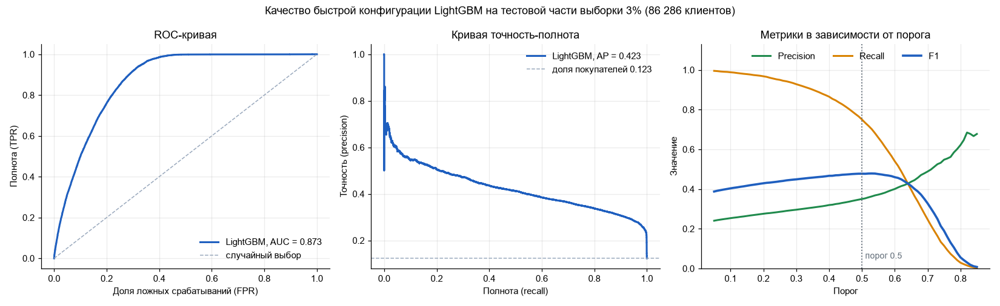

# Model Card: модель кросс-продаж автострахования

Описание в формате Model Card (структура по статье Mitchell et al. «Model Cards for Model Reporting» и
шаблону Google Model Card Toolkit): детали модели, назначение, факторы, метрики, данные, количественный анализ,
этика, ограничения и рекомендации.

Место модели в процессе описано в [Model_BPMN.md](Model_BPMN.md), процесс переобучения в
[Model_retrain_BPMN.md](Model_retrain_BPMN.md).

## 1. Детали модели (Model Details)

| Поле | Значение |
|---|---|
| Название | Insurance Cross-Sell Classifier (кросс-продажи автострахования) |
| Версия | 0.1.0 (версия пакета `insurance-cross-sell`) |
| Тип модели | Градиентный бустинг над деревьями решений (LightGBM), бинарная классификация |
| Реализация | `sklearn.pipeline.Pipeline`: препроцессор (`ColumnTransformer`) и `LGBMClassifier`; код в `src/insurance_cross_sell/` |
| Основные библиотеки | LightGBM 4.7, scikit-learn 1.7, pandas 2.3 (точные версии в `poetry.lock`) |
| Разработчики | команда «Страховщики»: Роман Осипов, Дмитрий Мартынов, Дмитрий Иванков |
| Дата | октябрь 2026 |
| Гиперпараметры | две конфигурации (см. ниже): быстрая с параметрами из `config.BEST_PARAMS` (подобраны на выборке 3%) и финальная с параметрами, подобранными Optuna на 40% всех данных по ROC-AUC (`docs/tuned_run/lightgbm_full_data_params.json`) |
| Лицензия | для кода лицензия не указана; данные распространяются по CC BY 4.0 (условия соревнования Kaggle) |
| Контакты | через Issues репозитория `Grobiks/insurance-cross-sell-production` |
| Источник данных (цитирование) | Walter Reade and Ashley Chow. Binary Classification of Insurance Cross Selling. https://www.kaggle.com/competitions/playground-series-s4e7, 2024. Kaggle |
| Ссылки | Mitchell et al. «Model Cards for Model Reporting» (arXiv:1810.03993); Google Model Card Toolkit; соревнование Kaggle Playground Series S4E7 |
| Дополнительные материалы | [README.md](README.md), [docs/RESULTS.md](docs/RESULTS.md), [docs/FULL_DATA_REPORT.md](docs/FULL_DATA_REPORT.md), [docs/TUNING_REPORT.md](docs/TUNING_REPORT.md) |

Для сравнения в проекте также обучаются логистическая регрессия, Random Forest и CatBoost
(см. раздел 7). Основной рабочей моделью выбрана LightGBM как лучшая по F1 и ROC-AUC.

**Конфигурации LightGBM.**

| | Быстрая (по умолчанию) | Финальная (для эксплуатации) |
|---|---|---|
| Назначение | разработка, тесты, CI | рабочая модель |
| Данные обучения | стратифицированная выборка 3% (259 тыс. строк) | все данные (8.4 млн строк) |
| Параметры | `config.BEST_PARAMS`: 753 дерева, `learning_rate` 0.017, 98 листьев | `docs/tuned_run/lightgbm_full_data_params.json`: 2397 деревьев, `learning_rate` 0.039, 242 листа, `scale_pos_weight` 5.04 |
| Порог | 0.5 | 0.62 (максимум F1 на проверочной части) |
| ROC-AUC / F1 на тесте | 0.873 / 0.477 | **0.881 / 0.494** |
| Время обучения | секунды | около часа на CPU, нужно около 12 ГБ памяти |
| Команда | `insurance train --model lightgbm` | `insurance train --model lightgbm --sample-frac 1.0 --params-file docs/tuned_run/lightgbm_full_data_params.json --threshold 0.62` |

**История версий.**

| Версия | Дата | Что изменилось |
|---|---|---|
| Исходный ноутбук | декабрь 2025 | Исследование команды: 4 модели, подбор на выборке 3%, F1 0.475 |
| 0.1.0, быстрая конфигурация | октябрь 2026 | Код вынесен в пакет, исправлены ошибки ноутбука, параметры из ноутбука, F1 0.477, ROC-AUC 0.873 |
| 0.1.0, финальная конфигурация | октябрь 2026 | Параметры подобраны на 40% всех данных, обучение на всех данных, порог 0.62: F1 0.494, ROC-AUC 0.881 |

Сериализация: объект `ModelBundle` (пайплайн, порог, список признаков, метрики, версия пакета)
сохраняется через `joblib` в файл `model.joblib`.

## 2. Назначение (Intended Use)

**Решаемая задача.** Клиент страховой компании уже застраховал здоровье. Модель оценивает вероятность того, что
он откликнется на предложение **автомобильной страховки** (кросс-продажа). Целевая переменная `Response`:
1 если клиент заинтересовался, 0 если нет.

**Основное применение.** Ранжирование клиентов по вероятности отклика, чтобы предлагать продукт сначала тем,
кому он наиболее вероятно нужен, и не тратить ресурсы на обзвон остальных.

**Целевые пользователи.** Аналитики и маркетологи страховой компании, сотрудники, формирующие списки обзвона.

**Вне области применения (out of scope).**
- автоматический отказ клиенту в обслуживании, ограничение условий или любое решение, влияющее на права клиента;
- определение цены или условий страховки;
- применение к другому продукту, рынку или периоду без повторной проверки качества;
- использование вероятностей как точных значений риска (они не откалиброваны, см. раздел 9).

## 3. Входные и выходные данные

### Вход

Таблица клиентов, одна строка на клиента. Колонки и допустимые значения проверяются перед предсказанием
(`validate_features`); при нарушении схемы возвращается понятная ошибка.

| Признак | Тип | Допустимые значения | Смысл |
|---|---|---|---|
| `Gender` | категория | `Male`, `Female` | пол |
| `Age` | целое | 20-85 | возраст |
| `Driving_License` | бинарный | 0, 1 | есть ли водительские права |
| `Region_Code` | код региона | 0-52 | регион клиента |
| `Previously_Insured` | бинарный | 0, 1 | есть ли уже страховка на автомобиль |
| `Vehicle_Age` | порядковый | `< 1 Year`, `1-2 Year`, `> 2 Years` | возраст автомобиля |
| `Vehicle_Damage` | бинарный | `Yes`, `No` | были ли повреждения автомобиля |
| `Annual_Premium` | число ≥ 0 | | годовая премия по текущему полису |
| `Policy_Sales_Channel` | код канала | 1-163 | канал, через который продан полис |
| `Vintage` | целое | 10-299 | сколько дней клиент связан с компанией |

Пропуски недопустимы. Колонка `id` необязательна и используется как индекс результата.

### Выход

| Поле | Тип | Описание |
|---|---|---|
| `probability` | число от 0 до 1 | оценка вероятности отклика (используется для ранжирования) |
| `prediction` | 0 или 1 | решение при пороге `threshold` (0.5 в быстрой конфигурации, 0.62 в финальной): 1 если `probability ≥ threshold` |

### Предобработка внутри модели

Преобразования входят в пайплайн и обучаются только на обучающей части: коды региона и канала продаж остаются
категориальными признаками, бинарные признаки кодируются 0/1, возраст автомобиля кодируется по порядку,
годовая премия и остальные числа передаются как есть (деревьям масштабирование не нужно). Значения кодов,
не встречавшихся при обучении, превращаются в пропуск и обрабатываются моделью как пропущенные.

## 4. Факторы (Factors)

**Релевантные факторы**, по которым проверялось качество: пол, возрастная группа, возраст автомобиля,
наличие страховки ранее, наличие повреждений автомобиля. Для сильно несбалансированных срезов качество
меняется (см. раздел 7).

**Факторы оценки.** Метрики считались по всей тестовой выборке и в разрезах по этим группам.
Условия съёмки/оборудования не применимы (табличные данные).

## 5. Метрики (Metrics)

- **ROC-AUC** главная метрика ранжирования, не зависит от порога. Именно её использует соревнование Kaggle.
- **F1** при пороге 0.5 метрика курса: баланс точности (precision) и полноты (recall) для редкого класса
  (около 12% положительных). Дополнительно приводятся precision и recall.
- **Охват при обзвоне топ-N%** прикладная метрика: какую долю покупателей содержит верхняя часть списка.
- **Порог решения.** В быстрой конфигурации 0.5 по умолчанию; в финальной 0.62, подобран по максимуму F1 на
  проверочной части обучающих данных (не на тесте). Под бизнес-метрику (стоимость звонка, прибыль с продажи) порог
  не оптимизировался; меняется параметром `--threshold`. В разделе 7 показано, как метрики зависят от порога.

## 6. Данные оценки и обучения

**Источник.** Kaggle Playground Series S4E7, Binary Classification of Insurance Cross Selling. Набор
**синтетический**: сгенерирован нейросетью по реальным данным Health Insurance Cross Sell Prediction.
Всего 11 504 798 строк, 11 колонок; доля положительного класса 12.3%.

**Разбиение.** Стратифицированное (сохраняется доля классов), 75% обучение и 25% тест, фиксированное зерно 42.
Тестовая часть не используется ни при обучении, ни при подборе параметров.

| Эксперимент | Строк в обучении | Строк в тесте |
|---|---|---|
| Выборка 3% (быстрая конфигурация, локально) | 258 857 | 86 286 |
| Все данные, прежние параметры (Google Colab) | 8 628 597 | 2 876 200 |
| Подбор параметров (Google Colab) | 40% всех данных: 3.45 млн обучение, 1.15 млн проверка | не используется |
| Финальная конфигурация (Google Colab) | 8 369 739 (ещё 258 858 строк на раннюю остановку и подбор порога) | 2 876 200 |

**Очистка.** Удаляется одна строка с аномальным значением региона 39.2, остальные данные без пропусков
и дубликатов.

## 7. Количественный анализ (Quantitative Analyses)

### Общее качество на тесте

| Модель | F1 (3%) | ROC-AUC (3%) | F1 (все данные) | ROC-AUC (все данные) |
|---|---|---|---|---|
| **LightGBM, финальная конфигурация (подобранные параметры, порог 0.62)** | | | **0.494** | **0.881** |
| LightGBM, быстрая конфигурация (порог 0.5) | 0.477 | 0.873 | 0.488 | 0.879 |
| CatBoost | 0.472 | 0.868 | 0.472 | 0.868 |
| Random Forest | 0.444 | 0.861 | 0.438 | 0.861 |
| Логистическая регрессия | 0.403 | 0.836 | 0.402 | 0.835 |

Финальная конфигурация на тесте: precision 0.378, recall 0.711. При пороге 0.5 те же параметры дают precision
0.330, recall 0.863 и F1 0.478: из-за `scale_pos_weight` 5.04 оценки смещены вверх, поэтому порог подобран
отдельно. Подробности подбора в [docs/TUNING_REPORT.md](docs/TUNING_REPORT.md).

Быстрая конфигурация: precision 0.350, recall 0.750 на выборке 3% (0.355 и 0.779 на всех данных). Остальные
таблицы этого раздела (порог, охват, группы) посчитаны для быстрой конфигурации на тестовой части выборки 3%.

### Доверительные интервалы (95%)

| Конфигурация | Тест | ROC-AUC | F1 | Precision | Recall | Метод |
|---|---|---|---|---|---|---|
| Быстрая, порог 0.5 | 86 286 клиентов | 0.873 [0.871; 0.876] | 0.477 [0.470; 0.483] | 0.350 [0.343; 0.356] | 0.750 [0.742; 0.758] | бутстреп, 300 повторов |
| Финальная, порог 0.62 | 2 876 200 клиентов | 0.881 [0.881; 0.882] | 0.494 | 0.378 | 0.711 | для ROC-AUC формула Hanley-McNeil |

Интервалы узкие за счёт большого теста: различие быстрой и финальной конфигураций (0.873 против 0.881)
больше ширины интервалов. Для финальной конфигурации доступны только итоговые метрики, поэтому интервал
посчитан только для ROC-AUC.

### Графики (быстрая конфигурация, тест 3%)

PR-AUC (average precision) 0.423 при доле покупателей 0.123, то есть в 3.4 раза выше уровня случайного
выбора. F1 максимален около порога 0.5-0.55, дальше полнота быстро падает.

### Влияние порога (LightGBM, тест 3%)

| Порог | Precision | Recall | F1 | Доля отмеченных клиентов |
|---|---|---|---|---|
| 0.3 | 0.296 | 0.928 | 0.449 | 38.6% |
| 0.4 | 0.320 | 0.865 | 0.467 | 33.3% |
| **0.5** | **0.350** | **0.750** | **0.477** | **26.4%** |
| 0.6 | 0.400 | 0.540 | 0.460 | 16.6% |
| 0.7 | 0.488 | 0.247 | 0.328 | 6.2% |

### Охват покупателей при обзвоне лучших клиентов (тест 3%)

| Обзвонить лучших | Доля покупателей в списке | Конверсия в списке | Выигрыш относительно случайного обзвона |
|---|---|---|---|
| 10% | 36.2% | 44.6% | в 3.6 раза |
| 20% | 61.8% | 38.0% | в 3.1 раза |
| 30% | 81.4% | 33.4% | в 2.7 раза |
| 50% | 99.3% | 24.4% | в 2.0 раза |

Средняя конверсия без модели 12.3%.

### Сравнение с простым правилом

Правило «были повреждения автомобиля и нет страховки ранее» отмечает 47.7% клиентов, даёт precision 0.253,
recall 0.983, F1 0.403 и ROC-AUC 0.788. Модель по ROC-AUC лучше (0.873) и позволяет сузить список
(см. таблицу выше).

### Качество по группам (тест 3%, порог 0.5)

| Группа | Доля тестовых клиентов | Доля покупателей в группе | ROC-AUC | F1 |
|---|---|---|---|---|
| Женщины | 45.9% | 10.3% | 0.894 | 0.475 |
| Мужчины | 54.1% | 14.0% | 0.855 | 0.478 |
| Возраст 20-29 | 41.3% | 3.8% | 0.925 | 0.350 |
| Возраст 30-39 | 14.0% | 20.9% | 0.832 | 0.550 |
| Возраст 40-49 | 21.0% | 21.9% | 0.778 | 0.498 |
| Возраст 50-59 | 12.9% | 17.1% | 0.784 | 0.440 |
| Возраст 60+ | 10.8% | 9.4% | 0.815 | 0.328 |
| Автомобиль до 1 года | 44.1% | 4.2% | 0.934 | 0.420 |
| Автомобиль 1-2 года | 51.8% | 17.8% | 0.811 | 0.481 |
| Автомобиль старше 2 лет | 4.2% | 29.9% | 0.692 | 0.514 |
| Страховка ранее есть | 46.4% | 0.1% | 0.728 | 0.000 |
| Страховки ранее нет | 53.6% | 22.9% | 0.733 | 0.478 |
| Повреждений нет | 49.9% | 0.4% | 0.930 | 0.069 |
| Повреждения были | 50.1% | 24.1% | 0.719 | 0.480 |

Выводы:
- В группах, где покупателей почти нет («страховка ранее есть» 0.1%, «повреждений нет» 0.4%), модель при
  пороге 0.5 практически никого не отмечает, поэтому F1 близок к нулю. Это ожидаемо: положительных примеров
  там почти нет, и ошибкой модели это не является.
- Самое слабое ранжирование у группы «автомобиль старше 2 лет» (ROC-AUC 0.692, но это всего 4% клиентов) и
  у клиентов 40-59 лет (около 0.78).
- Между мужчинами и женщинами ROC-AUC различается (0.855 против 0.894), а F1 почти одинаков (0.478 и 0.475).
  Значения ROC-AUC внутри групп с разной долей покупателей не вполне сопоставимы между собой.

### Важность признаков

Два главных признака в обеих конфигурациях: `Vehicle_Damage` и `Previously_Insured` (в быстрой первым идёт
`Vehicle_Damage`, в финальной `Previously_Insured`), затем `Age`, `Policy_Sales_Channel`, `Vintage`,
`Region_Code`, их порядок немного различается. Это
согласуется с разведочным анализом (сильнейшие корреляции с целевой переменной). Файлы
`feature_importance.csv` лежат в `docs/full_data_run/` и `docs/tuned_run/`.

## 8. Этические соображения (Ethical Considerations)

| Риск | Что сделано в проекте | Меры при реальном применении |
|---|---|---|
| **Чувствительные признаки:** среди входов есть пол и возраст | Качество проверено по группам пола и возраста (раздел 7) | Юридическая проверка допустимости признаков; сравнение модели без пола; регулярный контроль метрик по группам |
| **Персональные данные** | Данные синтетические, реальных клиентов нет | Согласия клиентов, минимизация и защита данных, ограничение доступа |
| **Давление на клиентов**: частые звонки с предложениями | Модель только ранжирует, решений за клиента не принимает | Лимит контактов на клиента, возможность отказаться от звонков |
| **Неверное применение**: отказ в услуге или изменение цены по оценке модели | Такое применение явно вынесено за рамки (раздел 2) | Регламент использования модели, проверка новых сценариев перед запуском |
| **Небезопасная загрузка модели** (pickle) | Предупреждение в README и карточке | Загружать только свои артефакты; хранить их в защищённом реестре |

## 9. Ограничения и рекомендации (Caveats and Recommendations)

**Ограничения.**
- Данные синтетические, а не из реальной страховой компании. Качество на реальных клиентах может отличаться.
- Точность невысокая: при пороге 0.5 около 35% отмеченных клиентов реально откликаются (при средней конверсии 12%).
  Модель сокращает список для обзвона, но не угадывает покупателя.
- Вероятности **не откалиброваны**: при обучении используется `scale_pos_weight` (3.5 в быстрой конфигурации,
  5.04 в финальной), который смещает оценки вверх. Значения `probability` годятся для ранжирования, а не как
  точная вероятность.
- Качество упёрлось в плато: при подборе на больших данных пять лучших конфигураций с разными параметрами
  уложились в 0.0002 по ROC-AUC. Дальнейший рост возможен за счёт признаков или данных, а не параметров.
- Порог (0.5 или 0.62) выбран по F1, а не по стоимости звонка и прибыли от продажи.
- Параметры финальной конфигурации рассчитаны на полный объём: на выборке 3% они хуже быстрых (ROC-AUC 0.870
  против 0.873).
- Качество по срезам неоднородно (раздел 7), особенно для старых автомобилей.
- Модель не отслеживает сдвиг данных: мониторинга пока нет.
- Новые коды региона и канала продаж, не встречавшиеся при обучении, обрабатываются как пропуски.
- В быстрой конфигурации параметр `subsample` не действует без `subsample_freq` (как в исходном ноутбуке,
  оставлено для воспроизводимости); в финальной конфигурации `subsample_freq` 1 включён.

**Компромиссы (trade-offs).**

| Компромисс | Что выигрываем | Чем платим |
|---|---|---|
| Порог: точность или полнота | порог 0.62 даёт точность 0.378 и лучший F1; порог 0.5 находит 86% покупателей | при пороге 0.62 теряется около 29% покупателей; при 0.5 больше пустых звонков |
| Быстрая или финальная конфигурация | финальная: ROC-AUC 0.881 и F1 0.494 против 0.873 и 0.477 (тестовые выборки разные, но одного распределения) | около часа обучения на CPU и около 12 ГБ памяти вместо секунд |
| Качество или простота | LightGBM: ROC-AUC 0.873-0.881 | логистическая регрессия (0.836) и правило из двух признаков (0.788) проще объяснить |
| Взвешивание редкого класса (`scale_pos_weight`) | выше полнота, модель меньше пропускает покупателей | вероятности смещены вверх и не годятся как точные значения |

**Рекомендации.**
- Использовать оценку для **ранжирования списка** и выбирать порог или долю обзвона по экономике кампании.
- Перед внедрением на реальных данных проверить качество на новом отложенном периоде и справедливость по группам.
- Периодически переобучать модель и сравнивать с действующей версией перед заменой
  (процесс описан в [Model_retrain_BPMN.md](Model_retrain_BPMN.md)).
- Для роста качества искать новые признаки или дополнительные данные; откалибровать вероятности, если они
  нужны как числа.
- Хранить версию модели вместе с метриками и данными, на которых она обучена.
